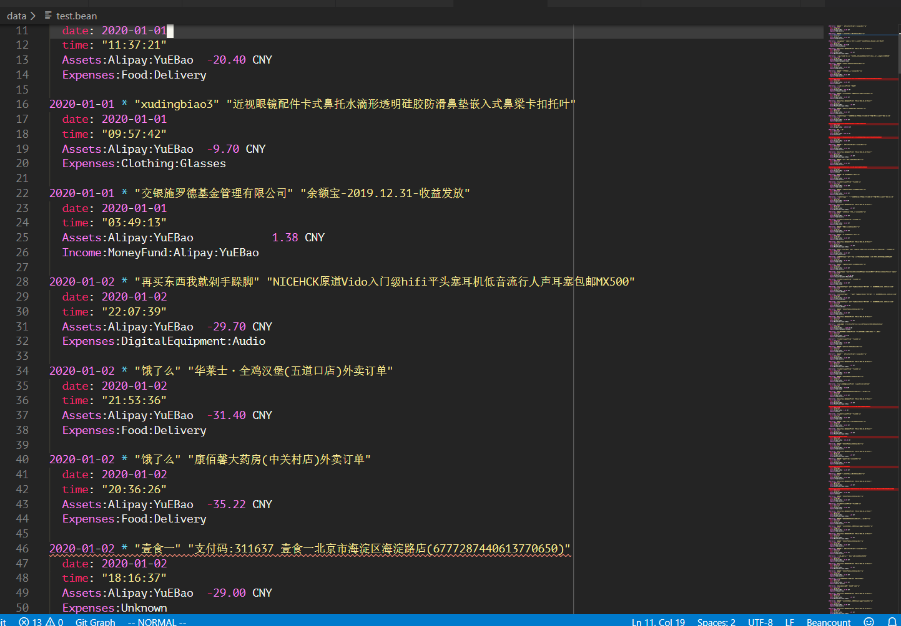

## 一些碎碎念

前几天父母问起我今年的收支情况，我才发现我今年的开销远超预想,为自己的大手大脚痛心不已。当晚找葱娘吐了下苦水，惊觉身边的人赢早已开始记账！受到人赢的激励，加上之前有看过[BYVoid的Beancount系列文章](https://www.byvoid.com/zhs/blog/beancount-bookkeeping-1)和[复式记账的自动化探索实践|高策](http://gaocegege.com/Blog/%E9%9A%8F%E7%AC%94/double-entry)，就决定尝试使用Beancount来记账。

由于Beancount的使用者寥寥，他的官方文档又放在google docs里，所以很难用搜索引擎搜到想要的信息。我在入坑这几天燃起过无数次当场退坑的想法，但最后还是被我忍了下来。我整理了一些资料如下：

- 用于入门理解概念的资料

  - [Command-line Accounting in Context](https://docs.google.com/document/d/1e4Vz3wZB_8-ZcAwIFde8X5CjzKshE4-OXtVVHm4RQ8s/edit)
  - [BYVoid的Beancount系列文章](https://www.byvoid.com/zhs/blog/beancount-bookkeeping-1)
  - [把自己当做一家公司：使用 beancount 记账](https://gitpress.io/c/beancount-tutorial/)
  - [Beancount使用经验](http://lidongchao.com/2018/07/20/has_header_in_csv_Sniffer/)

- 其他资料
  - [官方文档的第三方MkDocs版本，提供了搜索功能](https://xuhcc.github.io/beancount-docs/)
  - [Fava的官方文档，对beancount的源码进行了简略的解释](https://beancount.github.io/fava/usage.html)

回到正题。在真正对Beancount有了些许了解之后，我才发现事情不像我想得那么简单。一是手动记账还是非常麻烦，完全不适用于我这样的懒人；二是由于每个人的账户组织结构不一样，对账的流程也不一样，所以我几乎无法复用我能找到的所有自动化账单导入工具！那么摆在我面前的选择就只剩下一个，自己写importer。

在[这个评论](http://disq.us/p/25l5ng9)里列出了一部分中国beancount使用者写的自动化账单导入工具，我读了其中的一部分，最终决定使用官方的bean-extract提供的接口自己实现一个importer。

---

官方关于importer的介绍不多，我找到仅有的文章在这：[
Importing External Data in Beancount](https://xuhcc.github.io/beancount-docs/17_importing_external_data.html#importing-external-data-in-beancount)。另外，在官方的代码库下也已经有了一个[为csv格式账单设计的importer](https://bitbucket.org/blais/beancount/src/default/beancount/ingest/importers/csv.py)。我建议有心自己写Importer的读者可以先把这两个东西读一读。

## 为什么不使用官方的CSV Importer

因为无法在不改动官方CSV Importer代码的情况下，仅通过传入参数，使得它能适用于支付宝和微信的账单。我读代码的时候发现了以下几点主要的问题，或许还有更多：

- 支付宝和微信的账单都需要通过“收/支”一栏来判断该笔交易是收入还是支出，但官方CSV Importer并没有处理这一栏
- 官方CSV Importer提供了categorizer参数来用于给交易分类，但给categorizer传入的信息不足以用于分类
- 官方CSV Importer在读取文件全部内容的时候是直接`open(file_name)`而不是使用`file.contents()`，前者无法处理支付宝账单的编码问题。（由此我觉得写CSV Importer的人和`beancount.ingest.cache.FileMemo`的应该不是同一个人）。

## 自己动手写Importer

### 前言

代码已经放在[Github](https://github.com/Sphish/Beancount-CSVImporter)上，可以与本文相互参阅。此外，我在写这个Importer的时候沿袭了官方CSV Importer的结构，同时还大量借鉴了[lidongcao](https://github.com/lidongchao/BeancountSample/blob/master/my.config)的思路。由于我并不使用`bean-file`，所以这个Importer也并没有支持`bean-file`。

### 详解

#### Constructor

```python
    def __init__(
        self,
        config: Dict[Col, str],
        currency: str,
        file_name_prefix: str,
        skip_lines: int = 0,
        drcr_dict: Optional[Dict] = None,
        refund_keyword=None,
        account_map: Dict = {},
    ):
        """Constructor.

        Args:
          config: A dict of Col enum types to the names or indexes of the columns.
          currency: A currency string, the currenty of this account.
          file_name_prefix: Used for identification.
          skip_lines: Skip first x (garbage) lines of file.
          drcr_dict: A dict to determine whether a transcation is credit or debit.
          refund_keyword: The keyword to determine whether a transaction is a refund.
          account_map: A dict to find the account corresponding to the transactions.
        """

        assert isinstance(config, dict), "Invalid type: {}".format(config)
        self.config = config

        self.currency = currency
        assert isinstance(skip_lines, int)
        self.skip_lines = skip_lines
        self.drcr_dict = drcr_dict
        self.refund_keyword = refund_keyword
        self.account_map = account_map
        self.file_name_prefix = file_name_prefix
```

在[config.py](https://github.com/Sphish/Beancount-CSVImporter/blob/master/config.py)里有实例化Importer的示例，可以参照阅读。

- `config`: 表示在`Col`中定义的有效信息分别对应csv账单文件的哪一列，可参照config.py
- `currency`: 货币类型
- `file_name_prefix`: 账单文件的文件名前缀，用于`identify()`方法
- `skip_lines`: csv账单文件头的冗余行数
- `drcr_dict`: 表示一笔交易是收入还是支出
- `refund_keyword`: 退款交易记录的关键字
- `account_map`: 用于判断交易涉及的账户，后文会详细介绍

#### Identify

```python
    def identify(self, file: cache._FileMemo):
        if file.mimetype() != "text/csv":
            return False
        if not os.path.basename(file.name).startswith(self.file_name_prefix):
            return False
        iconfig, _ = normalize_config(self.config, file.head(), self.skip_lines)
        return len(iconfig) == len(self.config)
```

按照官方接口实现的函数，用于判断该Importer是否适用于传入的账单文件。

先使用简单的文件信息进行判断，然后判断`self.config`中指明的列名是否在csv文件中存在。

##### strip_blank

值得一提的是，`normalize_config()`这个函数使用了Python官方包里的`csv.Sniffer.has_header()`来判断csv文件是否有列名。但当我传入支付宝账单的时候，发现`csv.Sniffer.has_header()`竟然返回了`False`！仔细读了`csv.Sniffer`的代码之后，我由衷感叹写`csv.Sniffer`的老哥和支付宝写生成账单csv的老哥真是将遇良才，棋逢对手！

支付宝账单的很多列为了保证等宽在每个cell里加入了冗余的空格（虽然我不知道中英文夹杂下控制等宽有什么意义），而`csv.Sniffer.has_header()`恰恰认为header与其他行不应该等宽。所以导致`csv.Sniffer.has_header()`认为支付宝账单没有header。

为此，我不得不去掉支付宝账单中的冗余空格....

```python
def strip_blank(contents):
    """ 
    strip the redundant blank in file contents.
    """
    with io.StringIO(contents) as csvfile:
        csvreader = csv.reader(csvfile, delimiter=",", quotechar='"')
        rows = []
        for row in csvreader:
            rows.append(",".join(['"{}"'.format(x.strip()) for x in row]))
        return "\n".join(rows)
```

#### Extract

代码太长懒得贴过来了，直接说步骤

- 先要`normalize_config()`
- 然后依次读入每行（每个交易记录），利用`iconfig`提取出有效行
- 根据有效信息生成transcation entry，并利用`account_map`将transcation对应到正确的account上去
  ```python
                      primary_account = mapping_account(
                        self.account_map["assets"], account
                    )
                    txn.postings.append(
                        data.Posting(primary_account, units, None, None, None, None)
                    )

                    payee_narration = payee + narration
                    account_map = self.account_map[
                        "credit"
                        if drcr == Drcr.CREDIT
                        and not (
                            self.refund_keyword
                            and payee_narration.find(self.refund_keyword) != -1
                        )
                        else "debit"
                    ]

                    secondary_account = mapping_account(
                        account_map, payee_narration + tx_type
                    )
                    txn.postings.append(
                        data.Posting(secondary_account, None, None, None, None, None)
                    )
    ```

#### 针对支付宝账单的特殊处理

##### 编码问题

支付宝的账单csv文件使用的GB2312编码，直接读文件，使用`csv.reader`读取会出错。

注意extract函数和identify函数传入的file都是[`beancount.ingest.cache._FileMemo`](https://beancount.github.io/fava/api/beancount.ingest.html#module-beancount.ingest.cache)类型，我们在调用`file.contents()`和`file.head()`是都会自动处理好编码问题。

具体的实现是先用`chardet`对文件编码进行探测，然后在用对应的编码打开文件读取内容。可见[code](https://beancount.github.io/fava/api/beancount.ingest.html#module-beancount.ingest.cache)。

##### 尾部冗余信息

没想到什么优美的办法，加了个[特判](https://github.com/Sphish/Beancount-CSVImporter/blob/636ef2778b8512384f0e630aeca820c1385b5348/importers/CSVImporter.py#L258)。

##### 支付宝没有支付方式列

不像微信，你不能通过支付方式列去判断支付宝的某笔交易是使用信用卡结算还是使用余额宝结算。很坑。

我的方法是使用`bean-extract`前，在“备注”列手动添加支付方式信息。可参阅`config.py`。

### 账单导入流程

1. 下载账单并解压
2. （仅支付宝）在备注栏人工添加支付方式信息
3. `bean-extract config.py 微信支付账单xxx/alipay_record_xxxx.csv > xxxx.bean`
4. 人工校对`xxxx.bean`里的非法条目

### 推荐使用VSCode的beancount插件

他可以把不对劲的transcation entry给标出来，是对帐时不可或缺的好帮手。
